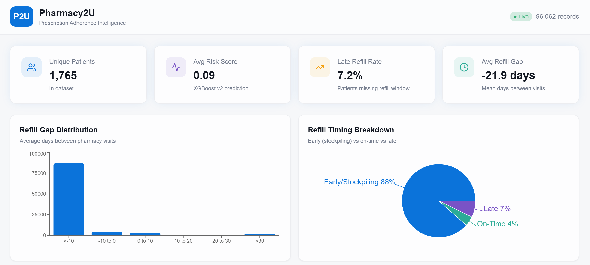

---

# Pharmacy2U — Late Refill Risk Prediction (Challenge A)

## Overview

Predicts which Medicare patients are at risk of late prescription refills using CMS DE-SynPUF data. Produces a continuous risk score (0–1) per patient, identifies the top drivers of non-adherence, and recommends next-best clinical actions.

## Repository Structure

```
├──    
├── pharmacy2u/
│   ├── hackathon_pipeline.ipynb                # Full ML pipeline (data prep → model → evaluation)
│   ├── final_delivery_data.csv
│       
├── frontend/                  # React UI (optional, requires npm)
│   ├── src/
│   ├── package.json
│   ├── vite.config.ts
│
├── Pharmacy2u_ppt.pptx
└── README.md
```


# 💊 AI Prescription Refill Recommendations


Welcome to the AI Prescription Refill Recommendations project! This repository contains a full-stack solution designed to analyze patient data and provide smart prescription refill recommendations using Machine Learning and a modern web interface.

---

## ⚙️ Prerequisites

Make sure you have the following installed on your machine before setting up the project:
* [Node.js](https://nodejs.org/)
* [Python 3.8+](https://www.python.org/downloads/)
* [Git](https://git-scm.com/)

---

## 🚀 Installation & Setup

Follow these steps to get the project running on your local machine.

### 1. Clone the Repository
```bash
git clone (https://github.com/siddhitandel/Hackathon_DATA_AI-Prescription_Refill_-_Recommendations.git)
cd Hackathon_DATA_AI-Prescription_Refill_-_Recommendations

```
### 1. Clone the Repository
```bash
cd pharmacy2u
```
# Create a virtual environment
```bash
python -m venv venv
```
# Activate the virtual environment
# Windows:
```bash
venv\Scripts\activate
```
# Mac/Linux:
```bash
source venv/bin/activate
```


# Install Jupyter and required data science packages
```bash
pip install jupyter pandas numpy scikit-learn
```
# Launch Jupyter Notebook
```bash
jupyter notebook
```

### cd frontend

# Install Node modules
```bash
npm install
```
# Start the development server
```bash
npm start
```
### 1. Run the ML Pipeline

```bash
pip install pandas scikit-learn xgboost matplotlib seaborn
jupyter notebook hackathon_pipeline.ipynb
```
### Dataset

**Input data**: Place the CMS DE-SynPUF files in a `Data/` folder (can be downloaded from [Dataset link](https://drive.google.com/drive/folders/171JntroqAmKF4i7XNsp-FHyYiBzeJHi7?usp=sharing)) :
- `DE1_0_2008_to_2010_Prescription_Drug_Events_Sample_1.csv`
- `DE1_0_2008_Beneficiary_Summary_File_Sample_1.csv`
- `DE1_0_2009_Beneficiary_Summary_File_Sample_1.csv`
- `DE1_0_2010_Beneficiary_Summary_File_Sample_1.csv`
- Inpatient claims file (any `*Inpatient*` CSV in `Data/`)

**Merged Data** :
- pharmacy2u/final_delivery_data.csv (can be downloaded from [Dataset link](https://drive.google.com/drive/folders/171JntroqAmKF4i7XNsp-FHyYiBzeJHi7?usp=sharing))


### 3. Run the Flask API + React Frontend (Optional)

**Terminal :**
```bash
cd frontend
npm install
npm run dev
# Runs on http://localhost:8081
```

## Methodology Summary

| Step | Detail |
|------|--------|
| **Label** | Late = next fill > 7 days/ 14 days after expected run-out (`SRVC_DT + DAYS_SUPLY_NUM`) |
| **Censoring** | Last fill per patient dropped (no future fill to evaluate) |
| **Features** | Age, Condition_Count, Out_Of_Pocket_Ratio, Was_Late_Last_Time, Drug_Load, Avg_Past_Gap, Was_Hospitalized |
| **Model** | XGBoost (scale_pos_weight=13) vs Logistic Regression baseline |
| **Validation** | Time-based split (train on 2008 and 2009, test on 2010) |
| **Metric** | PR-AUC (primary), ROC-AUC, calibration check |

## Output Files

- `final_delivery_data.csv` — 2,428 records with risk scores, predicted next drug, and recommended clinical actions

### React app Screenshots



## Team
- Umar Khan 
- Siddhi Tandel 
- Abhisri Ravi 
- Atharva Khamkar 